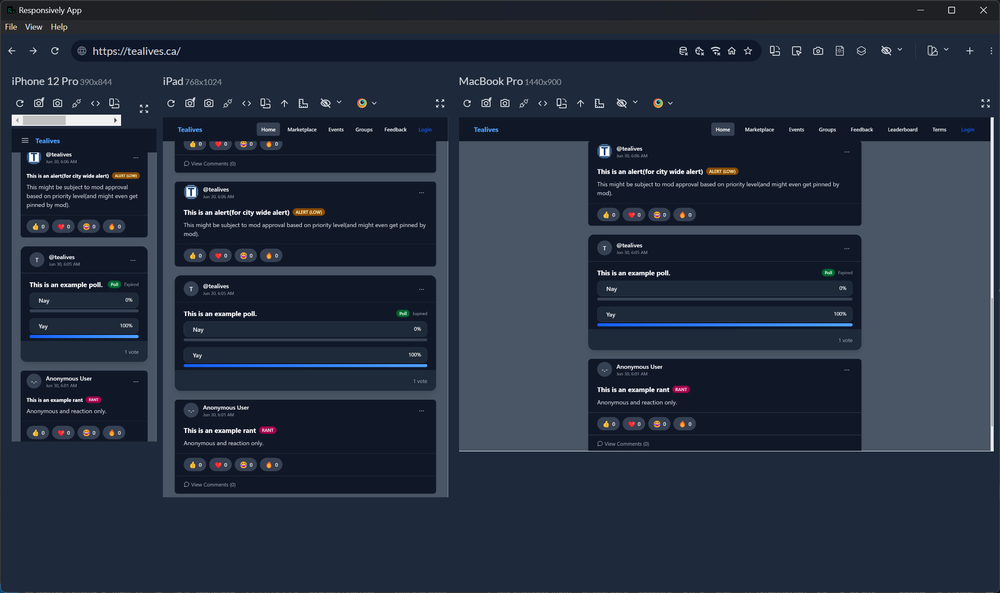
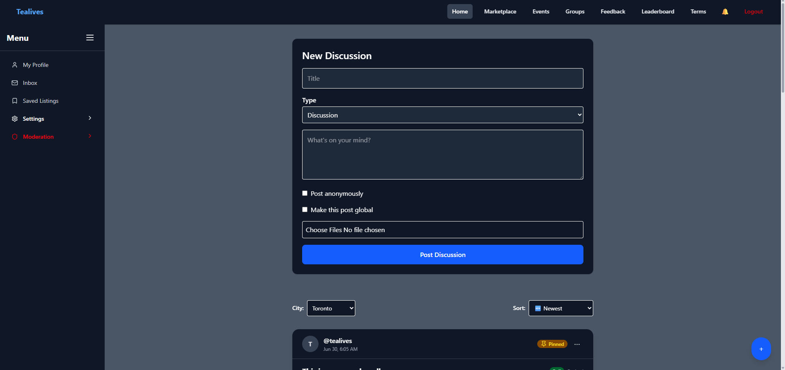
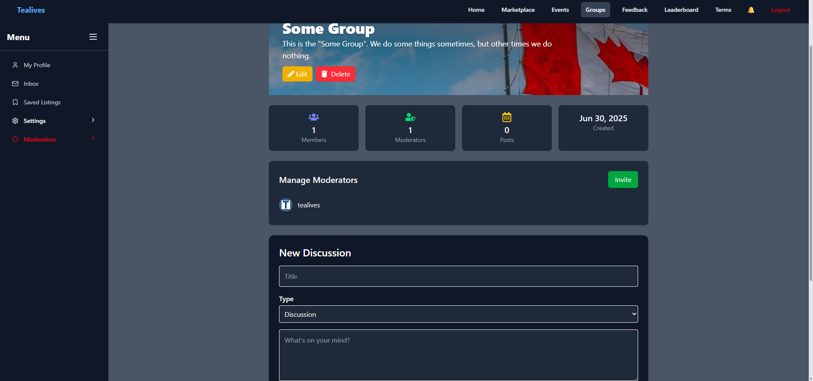
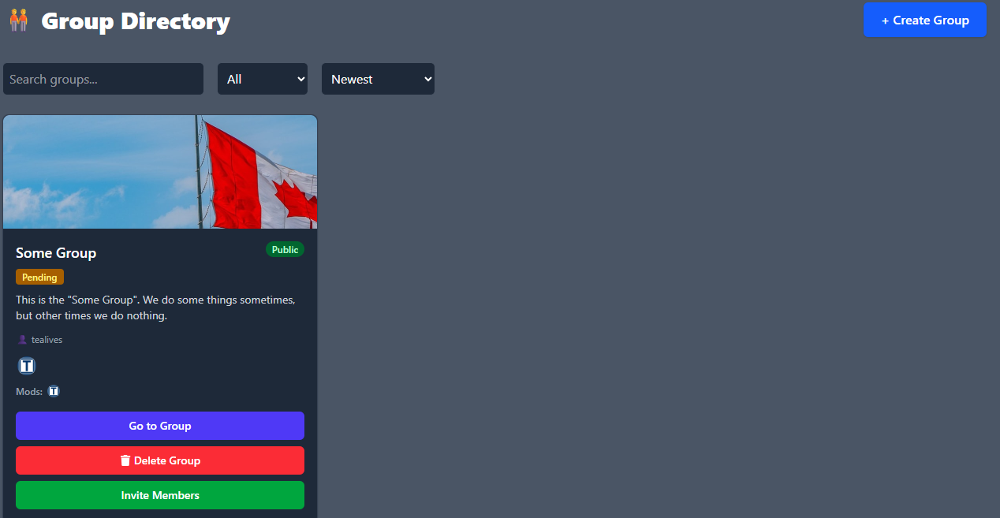
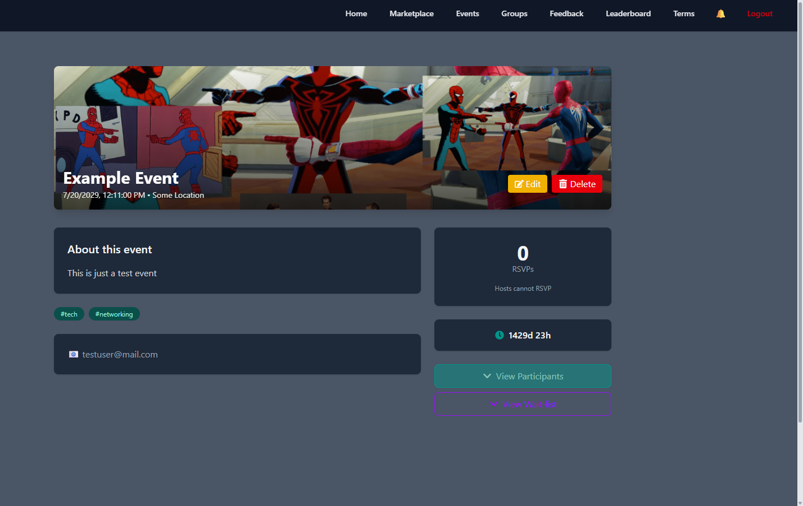
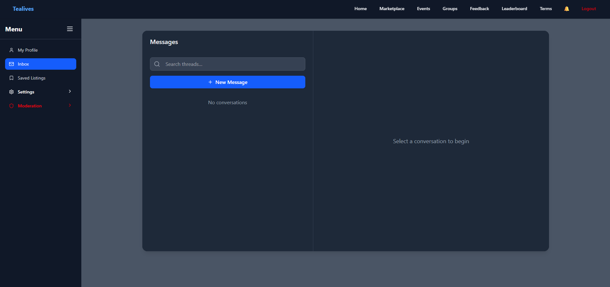

# Tealives

> **Life’s happening in your city. Join the conversation.**

Tealives is your one-stop hub for everything happening around you. Whether you want to connect with people, discover events, buy or sell items, or join groups, Tealives gives you the tools to stay connected with your community.

🌐 **Live demo:** [tealives.ca](https://tealives.ca)  
**Note: Render may take a while to spin up on first load, please try again in a minute or two**

**You may try visiting [render](https://tealives.onrender.com/api/health-check/) to wake the server up.**
---

## ✨ Features

### 👥 Connect & Converse
- **Discussions** – Share thoughts, ask questions, rant, or run polls.  
  - Each post type adapts:  
    - Discussions → threaded comments  
    - Rants → quick emoji reactions  
    - Polls → interactive voting  
    - Questions → community responses  
- **Groups** – Public or private communities built around local interests.

### 💬 Real-Time Chat (Highlight Feature)
- Fully asynchronous chat with real-time updates.
- Marketplace chat (for buyers & sellers) **differs from direct chat**:
  - Sellers can **mark items as sold directly from chat**.
  - Buyers see highlighted item details (name, price, view item option).
  - First-time chats hide “typing…” until a first message is sent.
- Realtime **notifications** for messages, offers, or event updates.
- File attachments and URL previews supported.
- Users can **report chats** if needed.

### 🛍 Marketplace
- Post, edit, pause, unlist, or mark items as sold.
- Buyers can chat with sellers directly inside the platform.
- Business listings with dedicated **profile pages** and analytics dashboard.
- Users can **rate and review listings** or businesses.

### 🎉 Events & RSVPs
- Create and customize event pages.
- Manage RSVP lists:
  - Add attendees to groups
  - Send mass notifications
  - Remove attendees if needed
- Real-time updates to keep everyone in the loop.

### 🏪 Businesses
- Dedicated profiles to showcase services/products.
- Analytics dashboard for insights.
- Community reviews for credibility and growth.

---

## 🚀 Getting Started

### 🔑 Demo Login
> **Signup is currently disabled** – but you can log in using:  
- **Username:** `testuser`  
- **Password:** `testuser`

### 🌐 Access
Frontend is hosted on **Vercel** and backend on **Render**, with **Supabase** powering storage and database.

---

## 🛠 Tech Stack

- **Frontend:** React, TailwindCSS  
- **Backend:** Django REST Framework  
- **Database & Storage:** PostgreSQL (via Supabase)  
- **Auth:** JWT-based authentication  
- **Realtime:** Django Channels + Redis (chat, notifications, live updates)  
- **Hosting:** Vercel (frontend), Render (backend)  
- **Other Tools:** Docker (local Redis setup)

---

## 📸 Screenshots

  
  
  
  
  
  

---

## 📍 Roadmap

- ✅ Launch-ready MVP  
- 🛠 Job Board (coming soon)  
- 🛠 Ridesharing / Carpool features  
- 🛠 More community-focused surprises  

---

## 👩‍💻 Development

Want to dig into the technical details?  
👉 See [`developer.md`](./developer.md) for more in-depth documentation.

---

## 📜 License

Private / Unlicensed.  
All rights reserved.

---

## 📖 Extra

This project was partially AI-assisted for boilerplate, code optimization and troubleshooting, but **core creativity, design, and features are original work**.  
Tealives is a **launch-ready MVP**, built to expand with features like job boards and rideshares.
